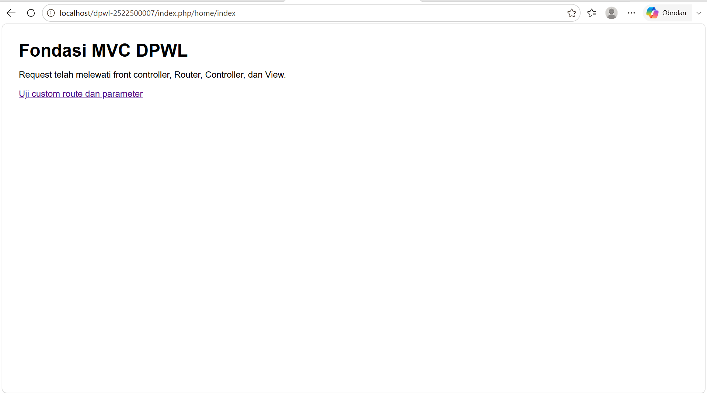
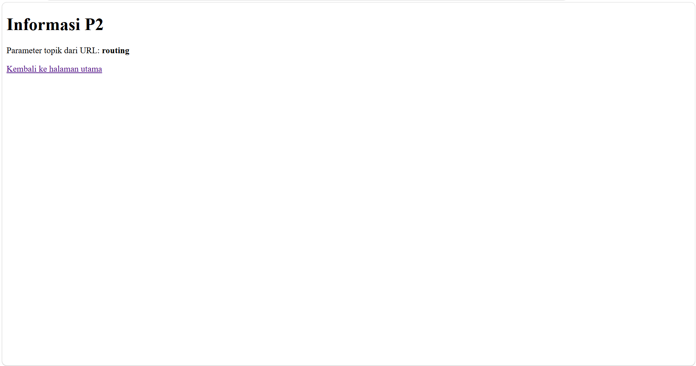

# pertemuan-02
## 1. Tujuan Praktikum 
kita harus  mampu memetakan dan menjelaskan perjalanan request HTTP dari saat pertama kali diterima oleh index.php,dan diproses oleh Router dan Controller sehingga menghasilkan View yang dirender kembali sebagai respon ke pengguna 

## 2. Struktur Direktori 
BASE: C:\laragon\www\dpwl-2522500007
├─ application ==>Tempat seluruh kode logika web kita
│  ├─ config
│  │  ├─ config.php ==> pengaturan umum web
│  │  └─ routes.php ==> pengatur url ke contoller
│  ├─ controllers
│  │  └─ home.php ==> proses logika ke halaman utama web
│  ├─ helpers
│  │  └─ url_helper.php ==> pembuat url otomatis
│  └─ views
│     └─ home ==> untuk tampilan html untuk beranda info.php
│        ├─ index.php ==>Pintu masuk utama aplikasi
│        └─ info.php ==>
├─ assets
│  └─ css ==> gaya visual
│     └─ app.css
├─ generatestrukturdirektorifile.php
├─ index.php
└─ system ==> berkas utama framework
   └─ core
      ├─ Router.php ==> membaca untuk menentukan controller yang aktif
      └─ controller.php ==> disini lah yang menyediakan fitur dasar untuk controller

## 3. Front controller 
untuk front controller dan satu-satunya pintu masuk yang aman untuk semua permintaan (request) ke aplikasi web

## 4. Routing dan Pemetaan URL 
| URL/Route | Controller | Method | Parameter | View | 
|---|---|---|---|---| 
| / | Home | index | - | home/index.php | 
| home/index | Home | index | - | home/index.php | 
| home/info/mvc | Home | info | mvc | home/info.php | 
| info/routing | Home | info | routing | home/info.php | 
jawaban:
Route Default (/)
Route Standar (home/index)
Route dengan Parameter (home/info/mvc)
Route Custom / Alias (info/routing)

| URL/Route | Controller | Method | Parameter | View |
|---|---|---|---|---|
| / | Home | index | - | home/index.php |
| home/index | Home | index | - | home/index.php |
| home/info/mvc | Home | info | mvc | home/info.php |
| info/routing | Home | info | routing | home/info.php |
| pasien/rekam/RM001 | Pasien | rekam | RM001 | pasien/rekam.php |

### Penjelasan Pemetaan Rute Modifikasi ATM (Konteks DPW)

* **URL / Route (`pasien/rekam/RM001`)**:
  * **Amati & Tiru:** Mengambil pola rute `{controller}/{method}/{parameter}` pada baris `home/info/mvc`.
  * **Modifikasi:** Disesuaikan dengan domain aplikasi DPW (Rekam Medis) untuk menampilkan data rekam medis pasien dengan ID `RM001`.

* **Controller (`Pasien`)**:
  * Berperan sebagai pengontrol utama yang menangani logika bisnis terkait data pasien dan rekam medis.

* **Method (`rekam`)**:
  * Fungsi di dalam Controller `Pasien` yang bertugas mengambil data rekam medis dari database dan menyiapkan tampilannya.

* **Parameter (`RM001`)**:
  * Data/argumen ID pasien yang dikirim melalui URL untuk menentukan rekam medis spesifik milik pasien mana yang harus diambil.

* **View (`pasien/rekam.php`)**:
  * File antarmuka (UI) tempat menyajikan data rekam medis dan resep obat pasien `RM001` kepada pengguna.

## 5. Base URL dan Helper

### Fungsi `base_url()` dan `site_url()`

* **`base_url()`**: kita gunakan untuk mengakses *root directory* (folder utama) aplikasi. Fungsi ini biasanya digunakan untuk memanggil aset-aset statis seperti file CSS, JavaScript, gambar, maupun pustaka media lainnya tanpa melalui *index.php* atau *controller*.
* **`site_url()`**: kita gunakan untuk membuat URL navigasi atau *routing* aplikasi. Fungsi ini secara otomatis menyertakan skema pengalamatan *index.php* (atau aturan *route* framework) di dalam URL agar mengarah secara tepat ke *Controller* dan *Method* yang dituju.


### Contoh Penggunaan pada Implementasi P2

#### 1. untuk memanggil File Asset (`assets/css/app.css`) menggunakan `base_url()`
Gunakan `base_url()` di dalam tag `<link>` HTML untuk memuat stylesheet:

```php
<link rel="stylesheet" type="text/css" href="<?= base_url('assets/css/app.css'); ?>">

## 6. Alur Request-Response

### 1. Alur Eksekusi P2 (Tanpa Database)
`Browser` → `index.php` → `Router` → `Controller` → `View` → `Response`

* **Browser:** Mengirimkan *request* melalui URL.
* **index.php & Router:** Pintu masuk awal yang memproses dan mengarahkan rute ke *Controller*.
* **Controller:** Memproses logika dasar dan memanggil *View*.
* **View:** Menyusun tampilan antarmuka (HTML/CSS).
* **Response:** Hasil tampilan dikirim kembali ke *Browser*.

---

### 2. Posisi Model pada MVC Lengkap (Dengan Database)
`Browser` → `index.php` → `Router` → `Controller` → `Model` → `Basis Data` → `Model` → `Controller` → `View` → `Response`

* **Controller:** Meminta data spesifik ke **Model**.
* **Model & Basis Data:** Model melakukan kueri ke **Basis Data**, mengambil hasilnya, lalu mengembalikannya ke Controller.
* **Controller & View:** Controller mengoper data ke **View** untuk digabungkan dengan layout.
* **Response:** Antarmuka yang berisi data siap ditampilkan di *Browser*.

---

> **Catatan:** Pada **P2**, komponen **Model** belum digunakan karena pengelolaan basis data baru diimplementasikan pada **P3**. 

## 7. Hasil Pengujian dan Debugging

### Tabel Skenario Pengujian

| No | Skenario Uji | Akses URL | Hasil yang Diharapkan / Tampilan | Status |
|---|---|---|---|---|
| 1 | Route Utama | `home/index` | Tampil "Fondasi MVC DPWL" & tombol link | **Valid** |
| 2 | Custom Route | `info/routing` | Tampil "Informasi P2" & parameter: **routing** | **Valid** |
| 3 | Route Tidak Valid | `home/salah` | Muncul Error 404 (Halaman tidak ditemukan) | **Tidak Valid (Sesuai)** |

---

### Hasil Pemeriksaan Sintaks dan Pengujian

Seluruh fungsi dan alur program berjalan lancar tanpa *error*:
1. **Pemeriksaan Sintaks:** File Controller, Router, dan View sudah dicek dan tidak ada kesalahan penulisan kode (*syntax error*).
2. **Pengujian Tampilan:**
   * URL `index.php/home/index` berhasil menampilkan pesan *"Request telah melewati front controller, Router, Controller, dan View"*[cite: 2].
   * URL `info/routing` berhasil membaca parameter URL dan menampilkannya menjadi *"Parameter topik dari URL: routing"*[cite: 3].

## 8. Bukti Tangkapan Layar 
Sisipkan gambar yang relevan dari folder dokumentasi/ dengan perintah: 
 
### Gambar 1. Hasil Pengujian Halaman Utama  
   
 
### Gambar 2. Hasil Pengujian Custom Route  
  